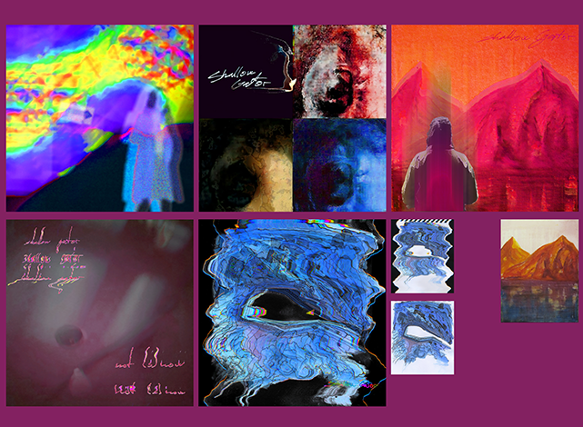
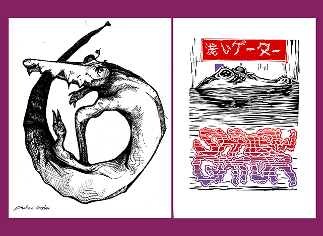
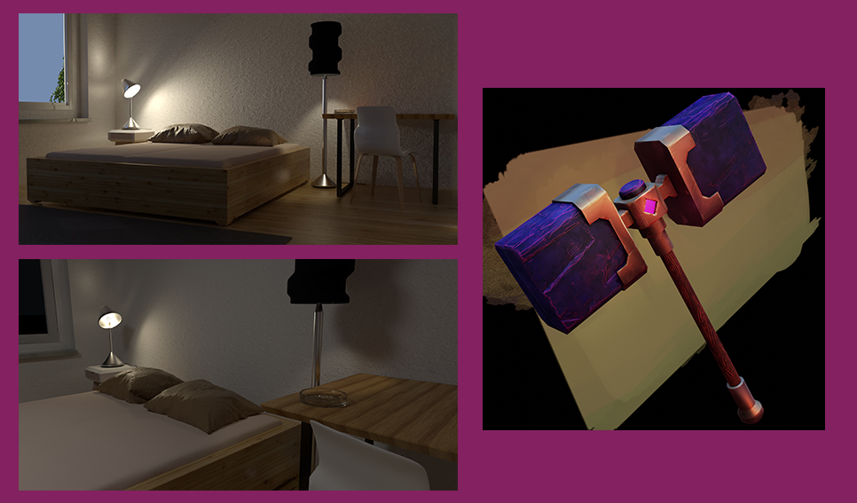
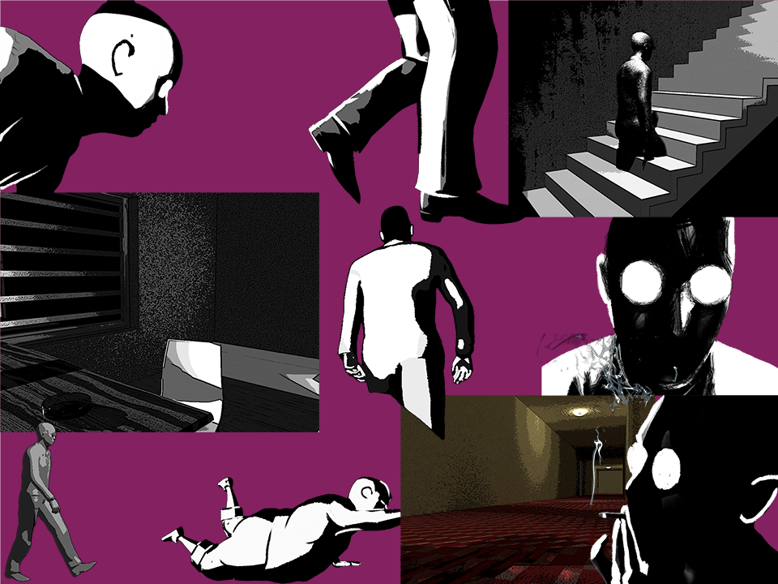
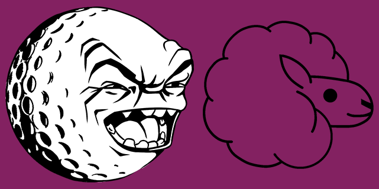

- [**Matúš Šeliga**](./index.md) <!-- Use `index.md` as well. `./` is a shortcut back to your home page `index.md` -->
    - [Work](work.md)
    - [Writing](writing.md)
    - [About](about.md)
## MY WORK

## a perpetual personal endeavor, multimedia project named: 

### shallow gator

Consisting of drawings, linocuts, collages, music and everything in between.

a series of collages combining painting, drawing and photography

an illustration and a linocut of the hypothetical gator mentioned

Link to some of my [musical endeavors](https://youtu.be/vD5ZIHvpqbM?si=bq7l1mWYVHtCFXhm/).

### Von F. Ishing

a short film named: "Von F. Ishing" about disassociation and apathy. Made and scored by me. (made in Cinema4D, DaVinci Resolve, Ebsynth, Krita and FL Studio) link: [Von F. Ishing](https://youtu.be/0G5CC8RI3Ic?si=XGYTa0uACpFmAhq6/) short film.

### some 3D work

a room render and stylized game asset hammer render

enviroment for a short film "Von F. Ishing"

### Logo for a golf tournament and for a sheep wool oriented clothing company

<!-- Use the same stucture above for the rest of your featured projects. -->

## Notes

Numbered comments about each featured project as presenter notes or speaking points.

1. …
2. …
3. …
<!-- And so on. -->
